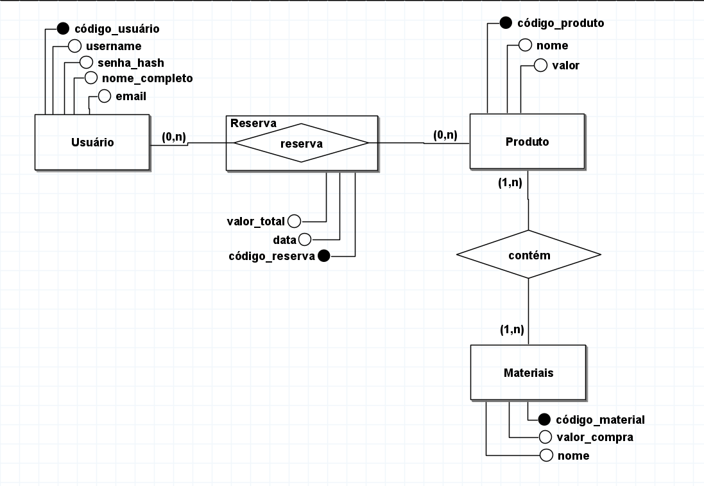

# Vivae - Backend (Monorepo de Microsserviços)

Este repositório contém os microsserviços corporativos do Vivae utilizando Domain-Driven Design (Avançado) sob o framework Express, TypeScript e ferramentas concorrentes.

## Estrutura de Microsserviços

Para organizar e isolar cada contexto do sistema, os microsserviços ficam isolados dentro de diretórios.

- **Catálogo (`listagem_produtos/src/catalogo/`)**: Microsserviço de gerenciamento do CRUD de Caixas de Assinatura e Caixas Antigas (na porta 8001).
- **Reservas (`carrinho/src/reserva.ts`)**: Microsserviço provisório para simular a tomada de reservas na porta 3002.

_(Novos microsserviços como Auth, Payment e EventBus serão incorporados nesta estrutura corporativa em breve)_.

## Configuração de Ambiente

Antes de rodar, é necessário apontar em qual porta cada microsserviço operará e qual será a rota de comunicação (CORS) com o Frontend.

Copie o `.env.example.<nome_da_pasta>` renomeando para `.env`:

```bash
cp .env.example.<nome_da_pasta> .env
```

## Como Rodar Localmente (Via Terminal Único)

Instale as dependências pela primeira vez:

```bash
npm install
```

Este projeto utiliza a biblioteca `concurrently` para processar e compilar as portas de múltiplos microsserviços independentes usando apenas um único comando. No seu terminal, rode o comando abaixo: (morto)

```bash
npm run dev
```

Esse comando irá levantar o Catálogo (porta 8001) e as Reservas (porta 3002) simultaneamente.

## Gerar a Build Final (TypeScript -> JavaScript)

```bash
npm run build
```

Todos os microsserviços serão compilados e minificados para a pasta `dist/` do sistema.

## Banco de Dados

O banco de dados é sediado no Aiven, seguindo o seguinte modelo:



## Rotas da API

### Autenticação — `http://localhost:8002`

| Método | Rota                         | Auth | Descrição                                      |
| ------ | ---------------------------- | ---- | ---------------------------------------------- |
| `GET`  | `/api/auth/health`           | —    | Status do serviço                              |
| `POST` | `/api/auth/register`         | —    | Cadastra usuário e envia e-mail de confirmação |
| `POST` | `/api/auth/login`            | —    | Login; retorna JWT (conta deve estar ativa)    |
| `GET`  | `/api/auth/confirmar/:token` | —    | Ativa conta pelo token recebido por e-mail     |

**Body — `POST /api/auth/register`**

```json
{
	"name": "string",
	"email": "string",
	"password": "string",
	"cep": "string (opcional)",
	"logradouro": "string (opcional)",
	"numeroCasa": "string (opcional)",
	"complemento": "string (opcional)"
}
```

**Body — `POST /api/auth/login`**

```json
{ "email": "string", "password": "string" }
```

---

### Catálogo de Produtos — `http://localhost:8001`

| Método   | Rota              | Auth  | Descrição                                        |
| -------- | ----------------- | ----- | ------------------------------------------------ |
| `GET`    | `/api/health`     | —     | Status do serviço                                |
| `GET`    | `/api/caixas`     | —     | Lista caixas (query: `?type=ASSINATURA\|AVULSA`) |
| `GET`    | `/api/caixas/:id` | —     | Busca caixa por ID                               |
| `POST`   | `/api/caixas`     | admin | Cria nova caixa                                  |
| `PUT`    | `/api/caixas/:id` | admin | Atualiza caixa                                   |
| `DELETE` | `/api/caixas/:id` | admin | Remove caixa                                     |

**Body — `POST/PUT /api/caixas`**

```json
{
	"name": "string",
	"description": "string (opcional)",
	"type": "ASSINATURA | AVULSA",
	"price": "number",
	"image": "string (opcional)",
	"stock": "number (opcional)"
}
```

---

### Carrinho/Reservas — `http://localhost:8003`

| Método | Rota            | Auth | Descrição         |
| ------ | --------------- | ---- | ----------------- |
| `GET`  | `/api/health`   | —    | Status do serviço |
| `POST` | `/api/reservas` | JWT  | Cria reserva      |

**Body — `POST /api/reservas`**

```json
{
	"experienceId": "number",
	"experienceName": "string",
	"price": "number",
	"address": {
		"cep": "string",
		"rua": "string",
		"numero": "string",
		"complemento": "string (opcional)"
	}
}
```
